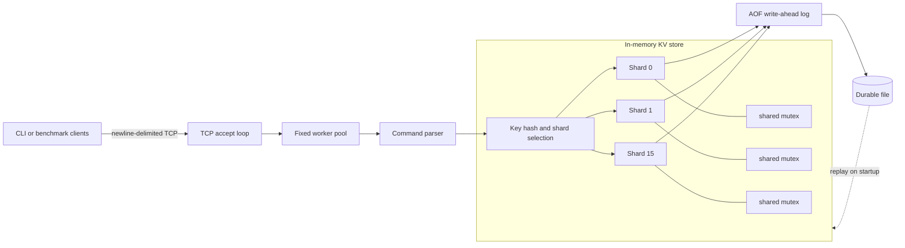
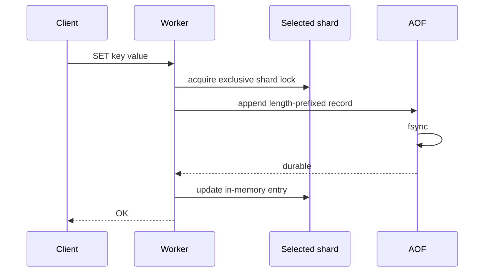

# cppkv

[](https://github.com/shrutilekkala/distributed-key-value-store/actions/workflows/ci.yml)

A multithreaded C++17 key-value server built from POSIX sockets, sharded locking, a fixed worker pool, and a crash-recoverable append-only log.

> **Scope:** cppkv is a single-node storage engine. Its 16 shards partition lock contention inside one process; they do not provide multi-node replication or consensus.

## What it demonstrates

- concurrent reads and writes across 16 independently locked shards
- TCP request handling through a fixed-size worker pool
- write-ahead persistence with length-prefixed records and `fsync`
- recovery by replaying the append-only file on startup
- TTL, deletion, existence checks, and a small text protocol
- unit, concurrency, persistence, protocol, and end-to-end smoke tests
- a reproducible multiclient benchmark rather than an unqualified performance claim

## Architecture



### Mutation flow



The shard lock remains held through the AOF append so mutations to the same key cannot be reordered in the recovery log. Reads take shared locks; mutations take exclusive locks only on the selected shard.

## Request flow

1. The accept loop hands each connection to the worker pool.
2. A worker reads a complete command line and validates its arguments.
3. The key hash selects one of 16 shards.
4. The operation acquires a shared or exclusive lock for that shard.
5. Mutations are written and synced to the AOF before the in-memory state changes.
6. The server uses complete-write loops so partial socket writes do not truncate responses.

## Quick start

Requirements: Linux or another POSIX environment, CMake 3.16+, and a C++17 compiler.

```bash
git clone https://github.com/shrutilekkala/distributed-key-value-store.git
cd distributed-key-value-store

cmake -S . -B build -DCMAKE_BUILD_TYPE=Release
cmake --build build -j"$(nproc)"
ctest --test-dir build --output-on-failure

./build/cppkv_server --port 6380 --threads 8 --aof cppkv.aof
```

In another terminal:

```bash
./build/cppkv_client --port 6380
> SET session token EX 60
OK
> GET session
VALUE token
> PING
PONG
```

### Docker

```bash
docker build -t cppkv .
docker run --rm -p 6380:6380 -v "$(pwd)/data:/data" cppkv
```

## Protocol

| Command | Response |
|---|---|
| `SET <key> <value>` | `OK` |
| `SET <key> <value> EX <seconds>` | `OK` |
| `GET <key>` | `VALUE <value>` or `NOT_FOUND` |
| `DEL <key>` | `DELETED` or `NOT_FOUND` |
| `EXISTS <key>` | `TRUE` or `FALSE` |
| `EXPIRE <key> <seconds>` | `OK` or `NOT_FOUND` |
| `PING` | `PONG` |

The network protocol intentionally accepts single-token keys and values. The internal AOF uses explicit lengths, so recovery remains safe when the storage API receives spaces or newlines.

## Correctness and recovery

The test suite covers:

- set, get, overwrite, delete, and existence checks
- TTL expiration and live-key size accounting
- 8 threads performing 16,000 writes without lost updates
- AOF recovery for ordinary and whitespace-containing keys and values
- command validation, including invalid TTLs and unknown commands
- a server/client smoke test in GitHub Actions

```bash
ctest --test-dir build --output-on-failure
```

CI builds the release binary, runs the tests, exercises the server over TCP, and builds the container image on every push and pull request.

## Benchmark

Run the server with the persistence policy you want to measure, then start the included load generator:

```bash
./build/cppkv_server --port 6380 --threads 16 --aof benchmark.aof
./build/cppkv_bench --port 6380 --clients 16 --ops 3000
```

Verified in Linux containers on Docker Desktop:

| Mode | Workload | Result |
|---|---:|---:|
| In memory (`--no-aof`) | 16 clients, 96,000 operations | **109,548 ops/sec**, 0 errors |
| Durable (`fsync` per mutation) | 16 clients, 3,200 operations | **536 ops/sec**, 0 errors |

The comparison makes the durability cost visible instead of presenting one throughput number without context. Treat both as reproducible reference points, not universal guarantees: filesystem, CPU, kernel, compiler flags, client count, and durability policy materially affect the result.

## Design decisions

### Sharded locking

A single global mutex would serialize unrelated keys. Hashing keys across 16 maps lets operations on different shards proceed independently while keeping the implementation understandable.

### Worker pool instead of an event loop

The fixed worker pool keeps connection ownership and request handling simple. An `epoll` or `io_uring` design would support more mostly-idle connections, but it would add state-machine complexity that is outside this version's scope.

### `fsync` on each mutation

The server favors a clear durability contract over maximum write throughput. Batching or a configurable `always`, `every-second`, and `none` policy would improve throughput while exposing an explicit data-loss window.

### Lazy TTL expiration

Expired keys are treated as absent during reads and excluded from logical size calculations. A background sweeper would reclaim unread expired entries but would introduce another source of lock contention.

## Current limitations

- single-node only; no replication, consensus, or partition tolerance
- no AOF compaction, snapshotting, or configurable sync policy
- one worker owns a connection until it closes
- text protocol values cannot contain spaces
- no authentication, encryption, quotas, or memory eviction policy
- POSIX socket implementation; Windows requires WSL or a Linux container

## Project layout

```text
.
|-- benchmark/          # multiclient load generator
|-- client/             # interactive TCP client
|-- include/            # public headers
|-- src/                # storage, protocol, thread pool, and server
|-- tests/              # dependency-free test harness
|-- .github/workflows/  # build, test, smoke test, and container CI
|-- CMakeLists.txt
`-- Dockerfile
```

## Roadmap

- configurable AOF sync policies and log compaction
- background expiration and memory limits
- an `epoll`-based connection layer
- binary-safe network framing
- leader/follower replication as a separate multi-node milestone

## License

MIT. See [LICENSE](LICENSE).
